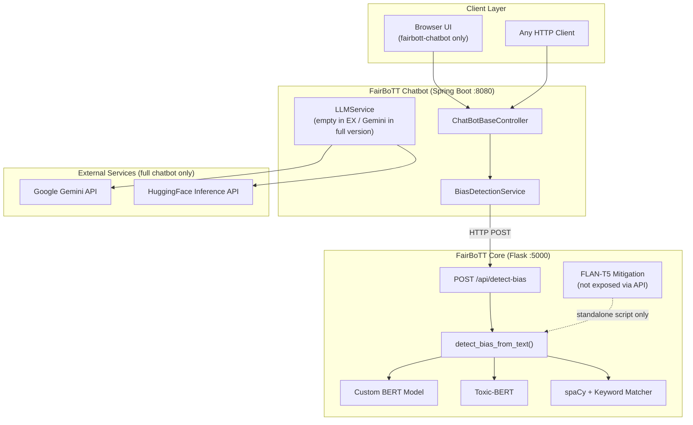
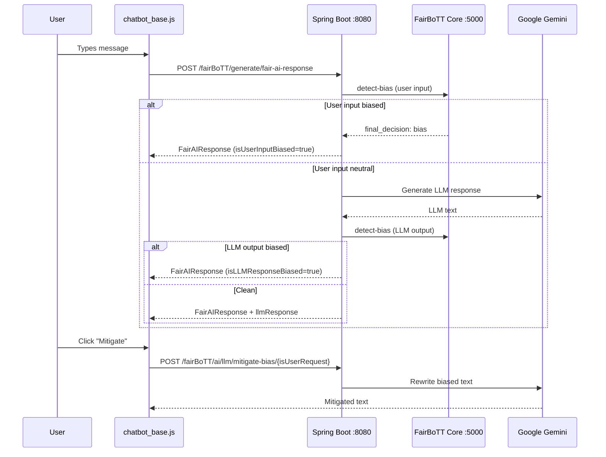

# FairBoTT — System Overview

FairBoTT is a **bias detection and mitigation platform** for conversational AI. It analyzes user input and LLM output for bias, classifies bias types, and can rewrite biased text into neutral language.

The system is split across two applications:

| Project | Role | Stack |
|---------|------|--------|
| **FairBoTT Core** | ML engine + REST API | Python, PyTorch, Transformers, Flask |
| **FairBoTT Chatbot** | Java API gateway (workspace version is a thin proxy) | Spring Boot 3.4, Java 17 |

There is also a **fuller multi-module chatbot** at `~/Development/projects/fairbott-chatbot` (UI, LLM integration, full bias mitigation flow). The workspace **FairBoTT Chatbot** project appears to be an early scaffold of that fuller version.

---

## High-Level Architecture



---

## FairBoTT Core

**Path:** `FairBoTT Core/`

### Purpose

Python ML backend that:

1. **Trains** a custom BERT binary classifier (biased vs neutral)
2. **Detects bias** at inference time using a multi-model ensemble
3. **Mitigates bias** locally with FLAN-T5 (script only — not wired to Flask API)
4. **Exposes** bias detection over HTTP

### Technology Stack

| Category | Technologies |
|----------|-------------|
| Language | Python 3.10 |
| ML / NLP | PyTorch 2.6, Hugging Face Transformers 4.50, BERT, Toxic-BERT, FLAN-T5 |
| NLP utilities | spaCy (`en_core_web_sm`), NLTK, PhraseMatcher |
| Data | pandas, scikit-learn |
| API | Flask 3.1, flask-cors 5.0 |
| Visualization (eval) | matplotlib, seaborn |

> **Note:** There is no `requirements.txt` in the repo — dependencies are installed in `.venv`.

### Project Structure

```
FairBoTT Core/
├── fairbott/
│   ├── api/
│   │   ├── bias_prediction_route.py   # Flask API entry point
│   │   ├── api_pipeline_test.py       # Inference pipeline (loaded at startup)
│   │   └── mitigation_model.py        # FLAN-T5 bias rewriting (standalone)
│   ├── configs/
│   │   └── config.py                  # Hardcoded paths to dataset & models
│   ├── data/
│   │   ├── data_preperation.py        # CSV loading & cleaning
│   │   └── keywords/
│   │       ├── bias_keywords.py       # 15 bias categories + mitigation phrases
│   │       └── mitigation_prompt.py # FLAN-T5 prompt template
│   ├── evaluation/
│   │   └── evaluation.py              # Metrics + confusion matrix
│   ├── feature/
│   │   └── feature_engineering.py     # BERT embedding generation
│   ├── model/
│   │   └── bias_detection_model.py    # BERT fine-tuning wrapper
│   ├── preprocessing/
│   │   └── text_preprocessor.py       # BERT tokenization
│   └── pipeline.py                    # Training pipeline entry point
└── .venv/
```

### External Dependencies (Not in Repo)

Configured in `fairbott/configs/config.py`:

| Asset | Path |
|-------|------|
| Training dataset | `FairBoTTDataset/fairbott_dataset_cleaned_for_training.csv` |
| Trained model weights | `FairBoTTDataset/fairbott_bias_model_v1_detection.pth` |
| Toxic-BERT | `FairBoTT Model History/.../toxic_bert` |
| FLAN-T5 (mitigation) | `FairBoTT Model History/.../flan-t5-base` |

### ML Pipeline — Training (`pipeline.py`)

1. Load CSV (`full_text`, `bias_label` columns)
2. Tokenize with `bert-base-uncased` (max length 128)
3. 80/20 train/validation split
4. Save embeddings and labels as `.pt` files
5. Train `BiasDetectionModel` (5 epochs, batch size 16, weighted loss for class imbalance)
6. Save weights to `fairbott_bias_model_v1_detection.pth`

### ML Pipeline — Inference (`api_pipeline_test.py`)

For each sentence (NLTK `sent_tokenize`):

```
1. FairBoTT BERT (binary) → bias/neutral + confidence
2. If biased → keyword matcher maps bias category
3. Context downgrade → spaCy entities + mitigation phrases
4. Toxic-BERT (fallback) → independent bias check
5. compare_results() → final decision per sentence
```

**Ensemble logic:**

| FairBoTT | Toxic-BERT | Outcome |
|----------|------------|---------|
| neutral | neutral | neutral |
| neutral | bias | bias (flagged for retraining) |
| bias | neutral | bias only if confidence ≥ 0.75 and type ≠ unknown |
| bias | bias | bias |

**Bias categories detected:** ability, race, gender, socioeconomic_class, body_type, profession, cultural, disability, race_ethnicity, characteristics, social, victim, religion, political_ideologies, nationality

### API

**Start the server:**

```bash
cd "FairBoTT Core"
source .venv/bin/activate
python -m fairbott.api.bias_prediction_route
# Runs on http://127.0.0.1:5000
```

**Endpoint:**

```
POST /api/detect-bias
Content-Type: application/json

{ "text": "Your paragraph or message here" }
```

**Response:**

```json
{
  "final_decision": "bias",
  "bias_types": ["gender", "race"],
  "average_confidence": 0.872,
  "sentence_results": [
    {
      "index": 0,
      "text": "Sentence one.",
      "decision": "bias",
      "bias_type": ["gender"],
      "confidence": 0.91
    }
  ]
}
```

**CORS:** Enabled for browser clients.

**Not exposed via API:** `mitigate_bias_text()` in `mitigation_model.py` (run directly as a script).

---

## FairBoTT Chatbot (Workspace)

**Path:** `FairBoTT Chatbot/FairBoTT Chatbot EX/`

### Purpose

Spring Boot **REST proxy** that sits in front of FairBoTT Core. It forwards bias detection requests and exposes a Java-friendly API. In the current workspace version, it is minimal:

- No working chat UI (empty Thymeleaf template)
- `LLMService` is an empty stub
- No Gemini / HuggingFace integration

### Technology Stack

| Category | Technologies |
|----------|-------------|
| Framework | Spring Boot 3.4.4 |
| Language | Java 17 |
| Build | Maven |
| HTTP client | RestTemplate |
| Templating | Thymeleaf (unused scaffold) |
| Utilities | Lombok, Jackson |
| DB drivers | H2, MySQL, PostgreSQL (declared, not used) |

### Project Structure

```
FairBoTT Chatbot EX/
├── src/main/java/com/fairbott/chatbot/
│   ├── FairBoTTChatbotApplication.java      # Spring Boot entry
│   ├── controller/
│   │   └── ChatBotBaseController.java       # REST endpoints
│   ├── api/
│   │   ├── client/BiasDetectionClient.java  # Interface
│   │   └── service/BiasDetectionService.java # HTTP client to Core
│   ├── common/ApiURLCommon.java             # /api/detect-bias path
│   ├── util/ApplicationConfigurations.java  # RestTemplate bean
│   ├── service/LLMService.java              # Empty stub
│   ├── data/request/BiasDetectionRequest.java
│   ├── response/BiasDetectionResponse.java
│   └── data/BiasDetectionSentenceResults.java
├── src/main/resources/
│   ├── application.properties
│   └── templates/chat-bot-base.html         # Empty placeholder
└── pom.xml
```

### Configuration (`application.properties`)

```properties
spring.application.name=FairBoTT Chatbot
fairbott.base.api.url=http://127.0.0.1:5000
server.port=8080
```

### API Endpoints

| Method | Path | Description |
|--------|------|-------------|
| `GET` | `/fairBoTT/chat/test` | Health check |
| `POST` | `/fairBoTT/chat/detect-bias` | Proxies to Core `POST /api/detect-bias` |

**Request:**

```json
{ "text": "Some text to analyze" }
```

**Flow:**

```
Client → ChatBotBaseController
       → BiasDetectionService
       → HTTP POST http://127.0.0.1:5000/api/detect-bias
       → BiasDetectionResponse (deserialized JSON)
```

### Known Issue in Workspace Version

`BiasDetectionSentenceResults.biasType` is typed as `String`, but Core returns `bias_type` as a **list**. The fuller `fairbott-chatbot` project correctly uses `List<String>` — deserialization may fail or drop data in the EX version.

---

## How They Connect

```
┌─────────────────────┐         HTTP POST          ┌─────────────────────┐
│  FairBoTT Chatbot   │  ────────────────────────► │   FairBoTT Core     │
│  localhost:8080     │  /api/detect-bias          │   localhost:5000    │
│  (Spring Boot)      │  { "text": "..." }         │   (Flask)           │
└─────────────────────┘                            └─────────────────────┘
```

**Contract:**

| Field | Direction |
|-------|-----------|
| Config key | `fairbott.base.api.url` → `http://127.0.0.1:5000` |
| Path | `/api/detect-bias` |
| Request body | `{ "text": string }` |
| Response | `final_decision`, `bias_types`, `average_confidence`, `sentence_results` |

**Startup order:**

1. Start **FairBoTT Core** first (model loading can take a while)
2. Start **FairBoTT Chatbot**
3. Call Chatbot endpoints (or Core directly)

---

## Fuller System: `fairbott-chatbot` (Related Project)

Located at `~/Development/projects/fairbott-chatbot` — this is the **production-shaped** chatbot with UI and LLM integration.

### Modules

| Module | Responsibility |
|--------|----------------|
| `chatbot-ui` | Controllers, Thymeleaf UI, static JS/CSS |
| `fairbott-core` | Bias detection client DTOs + service |
| `llm-connection` | Gemini + HuggingFace LLM calls |
| `common-configurations` | RestTemplate, shared constants |

### End-to-End Flow (Full Chatbot)



### Full Chatbot API

| Method | Path | Purpose |
|--------|------|---------|
| `GET` | `/fairBoTT/chat` | Chat UI page |
| `POST` | `/fairBoTT/chat/detect-bias` | Direct bias check |
| `POST` | `/fairBoTT/generate/fair-ai-response` | Full fair-AI pipeline |
| `POST` | `/fairBoTT/ai/llm/generate-response` | LLM + bias check on output |
| `POST` | `/fairBoTT/ai/llm/mitigate-bias/{isUserRequest}` | Gemini bias mitigation |

---

## Running Locally

### FairBoTT Core

```bash
cd "FairBoTT Core"
source .venv/bin/activate

# Ensure dataset/model paths in fairbott/configs/config.py exist
# Download spaCy model if needed:
# python -m spacy download en_core_web_sm

python -m fairbott.api.bias_prediction_route
```

### FairBoTT Chatbot (Workspace)

```bash
cd "FairBoTT Chatbot/FairBoTT Chatbot EX"
./mvnw spring-boot:run
```

### Test Core Directly

```bash
curl -X POST http://localhost:5000/api/detect-bias \
  -H "Content-Type: application/json" \
  -d '{"text": "Women are not good leaders."}'
```

### Test Chatbot Proxy

```bash
curl -X POST http://localhost:8080/fairBoTT/chat/detect-bias \
  -H "Content-Type: application/json" \
  -d '{"text": "Women are not good leaders."}'
```

---

## Gaps & Recommendations

| Gap | Suggestion |
|-----|------------|
| No `requirements.txt` in Core | Add pinned dependencies |
| Hardcoded absolute paths in `config.py` | Use environment variables or relative paths |
| `bias_type` DTO mismatch in Chatbot EX | Use `List<String>` like the full project |
| Mitigation only in Python script | Expose `/api/mitigate-bias` or keep Gemini-only in Java |
| API keys in `fairbott-chatbot` properties | Move to environment variables / secrets manager |
| Empty UI in Chatbot EX | Use `fairbott-chatbot` UI or build a frontend |
| No README in either repo | This file |

---

## Summary

| Question | Answer |
|----------|--------|
| **What does FairBoTT do?** | Detects bias in text using BERT + Toxic-BERT + NLP rules; can rewrite biased text |
| **What is Core?** | Python ML engine + Flask API on port 5000 |
| **What is Chatbot?** | Java Spring Boot gateway on port 8080 that calls Core |
| **How are they connected?** | Chatbot `BiasDetectionService` → `POST {fairbott.base.api.url}/api/detect-bias` |
| **Which is the "real" chatbot?** | Workspace EX is a thin proxy; `fairbott-chatbot` has the full UI + LLM + mitigation flow |
